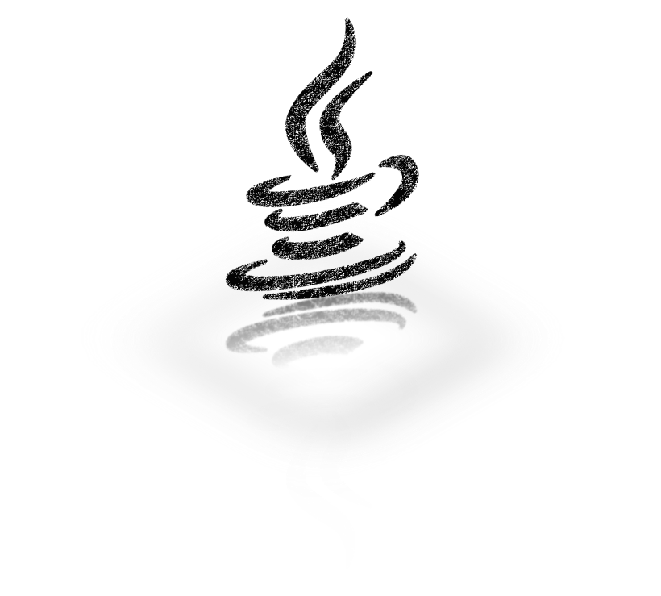
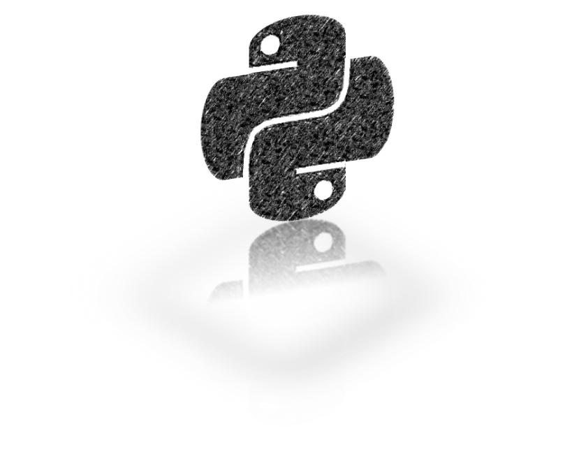

Overview
========

Step 1: Step up DongTai IAST Server
------------------------------------------------

You can register an account for the ``SaaS Version`` or deploy your own locally. 

We provide both ``Docker`` and ``Kubernetes`` deployment solutions.

.. image:: ../_static/02_start/docker.png
  :alt: docker
  :scale: 25%
  :target: 02_deploy.html#docker-compose

.. image:: ../_static/02_start/kubernetes.png
  :alt: kubernetes
  :scale: 25%
  :target: 02_deploy.html#kubernetes

Step 2: Install DongTai Agent to Your Web Application
----------------------------------------------------------
Select a language and start the installation.

Step 3: Start a New Security Testing
----------------------------------------------------------

.. tip:: Click the icon for further information.