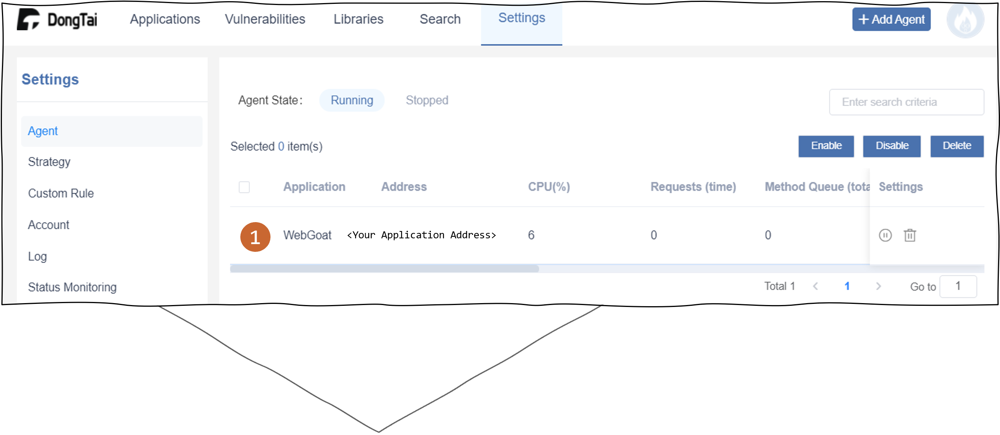
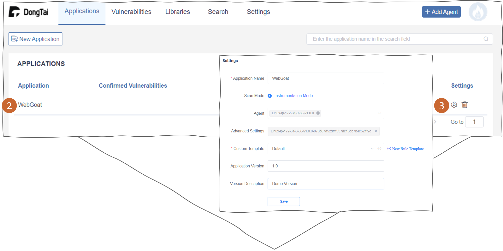
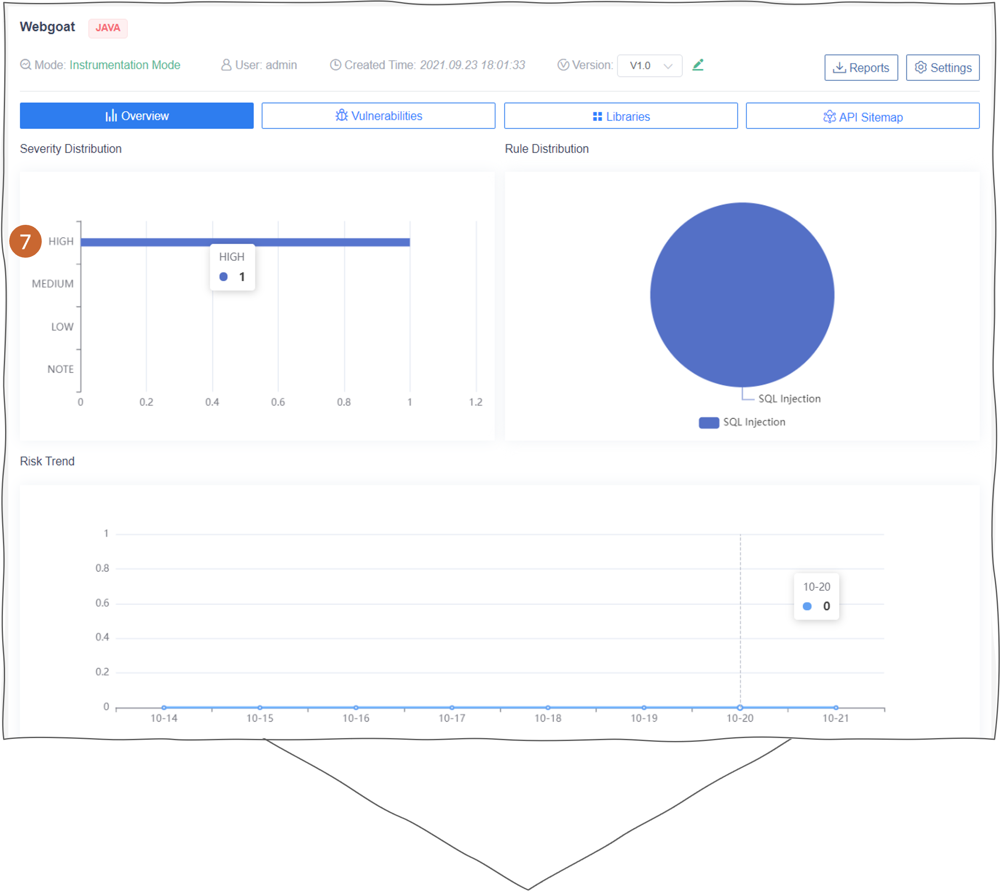

Start a New Security Testing
===============================
Step 0: Add agent and ensure agent is running
++++++++++++++++++++++++++++++++++++++++++++++
1. You can check the agent status at :blue:`Settings > Agent`. 

Step 1: Start a new application
++++++++++++++++++++++++++++++++
2. The agent can associate the application automatically and it can be found at :blue:`Applications`.

3. You can check or modify the application information in the setting as the graph below.

Step 2: Start a security testing
++++++++++++++++++++++++++++++++++
4. Head to your web application and invoke traffic.

.. image:: ../_static/04_ops/addapp02.png
  :alt: invoke traffic

Step 3: Check vulnerabilities detection
++++++++++++++++++++++++++++++++++++++++++
5. All detected vulnerabilities will be show on the dashboard.

.. image:: ../_static/04_ops/addapp03.png
  :alt: check

6. You can review the vulnerability and state it.

.. image:: ../_static/04_ops/addapp04.png
  :alt: overviewvul

7. Once the vulnerability was stated as `confirmed`, it will also be shown on the application overview.

