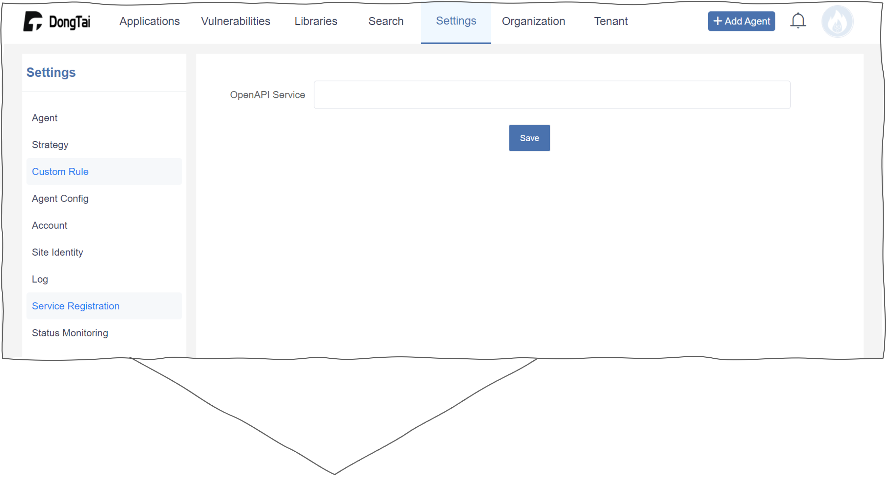

Administration
=================
Modify Password
----------------
:blue:`Settings > Account` to change password.

.. image:: ../_static/04_ops/admin00.png
  :alt: mpwd

Add OpenAPI
-----------------
:blue:`Settings > Service Registration` to set up the ``DongTai-OpenAPI`` URL.

Modify Agent
--------------
:blue:`Settings > Agent` to check agent status (``Running``, ``Stopped``) and modify agent state (``Enable``, ``Disable``, ``Delete``).

.. image:: ../_static/04_ops/admin02.png
  :alt: magent

Modify Application
-------------------
:blue:`Applications` to modify application information.

.. image:: ../_static/04_ops/admin03.png
  :alt: mapp
