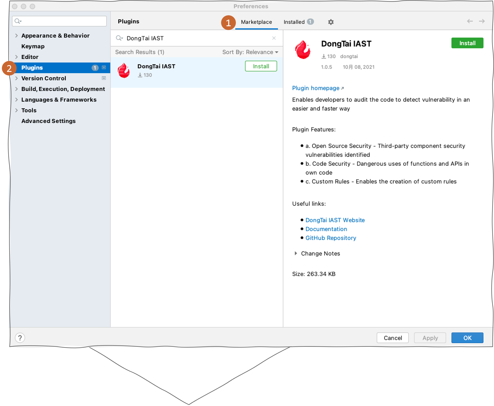
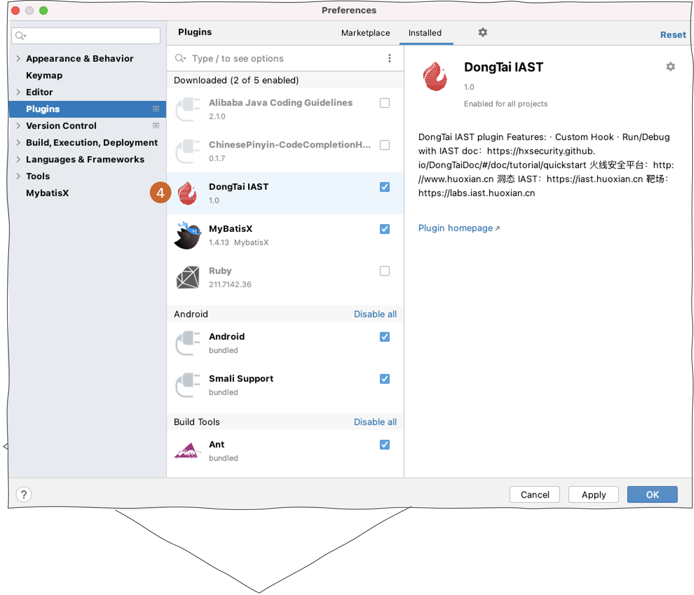
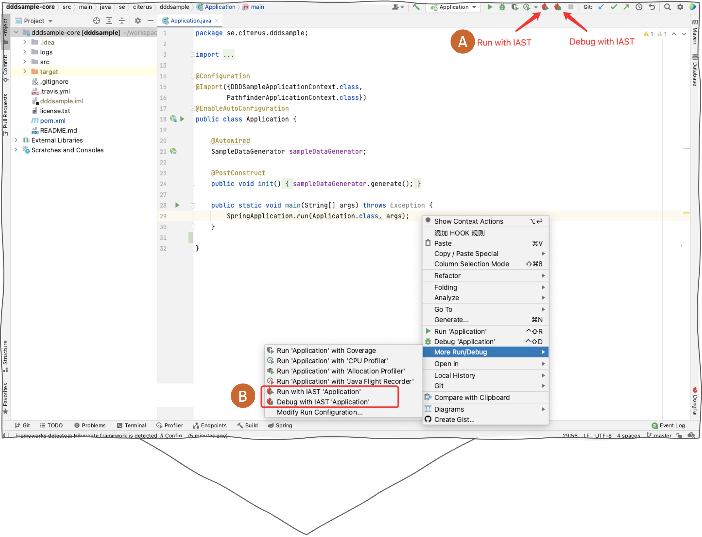
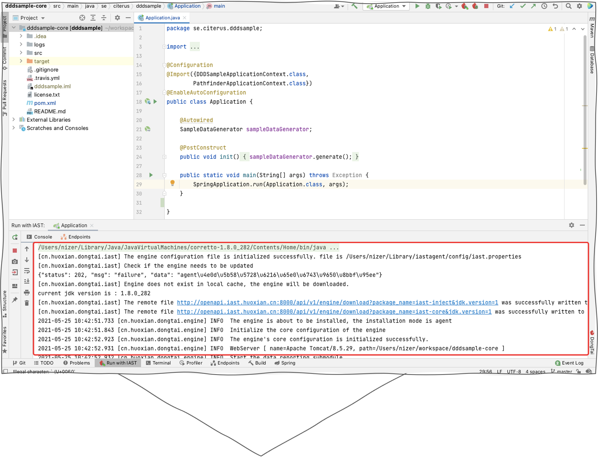
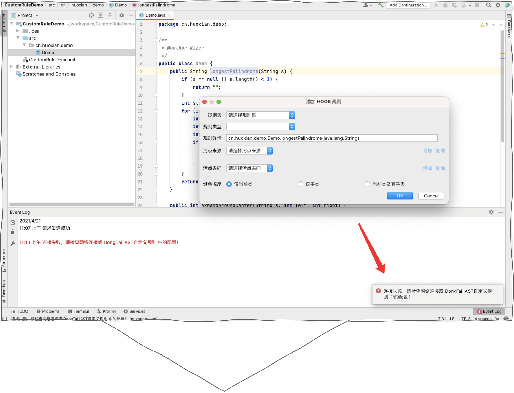

DongTai IAST Agent Plugin
===========================

Plugin for Intellij IDEA
---------------------------
Introduction
+++++++++++++
The DongTai IAST plugin for IntelliJ IDEA integrates with the development environment. 
It is a lightweight plugin option for developers, which works in conjunction with DongTai IAST to add software security testing and remediation functionality from the plugin. 

During the development stage, it enables developers to have an actionable and easily understands report including vulnerability type, code location, and implement appropriate solutions. 

Requirements
+++++++++++++
IntelliJ IDEA version: 2020.3 and above

Installation
+++++++++++++

Install from Marketplace
^^^^^^^^^^^^^^^^^^^^^^^^^^

- Search ``DongTai IAST`` in :blue:`Plugins > Marketplace` and install it.

Offline Install
^^^^^^^^^^^^^^^^^^

- Download |DongTai IDEA plugin|.

.. |DongTai IDEA plugin| raw:: html

   <a href="https://github.com/HXSecurity/DongTai-Plugin-IDEA/releases/download/v1.0/DongTai-Plugin-IDEA.zip">DongTai IDEA plugin</a>

- Open IntelliJ IDEA and navigate to :blue:`Preferences > Plugin`. Selected :blue:`Install Plugin from Disk` and then install DongTai IAST IntelliJ IDEA plugin.

.. image:: ../_static/05_ext/plugin_download.png
  :alt: plugin_download

.. image:: ../_static/05_ext/plugin_download_disk.png
  :alt: plugin_download_disk

Configuring Plugin
+++++++++++++++++++++

- Navigate to DongTai IAST Mangement platform :blue:`Add Agent` to get ``Token``.

.. image:: ../_static/05_ext/iast_token.png
  :alt: iast_token

- Navigate to :blue:`Tools > DongTai IAST Cloud Service Configuration` in IDEA and fill in the ``Token``.

.. image:: ../_static/05_ext/plugin_url_configs.png
  :alt: plugin_url_configs

.. note::
  
  ``agentUrl, url``:  The URL will auto-fill in if you using the DongTai IAST SaaS version. For self-deploy, you :red:`NEED` to fill in on your own.

Run/Debug with the plugin
++++++++++++++++++++++++++
- There have two way to ``Run`` and ``Debug`` with DongTai IAST plugin as the graph below. Using ``Run`` and ``Debug`` to start an application security testing. 

- You can find the security testing status message from the ``Console``.

- You can overview the result in real-time from the plugin.

.. image:: ../_static/05_ext/plugin_taint_details.png
  :alt: plugin_taint_details

Troubleshooting
++++++++++++++++++
- If the ``Event Log`` prompt an error message windows. Please check the ``Token`` and try again.

