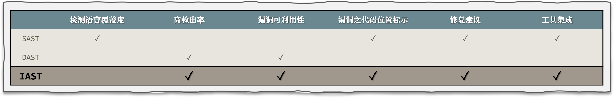

IAST 简介
============
交互式应用安全测试（Interactive Application Security Testing）是Gartner在2012年提出的一项新的应用安全测试方案。

IAST 相当于 DAST 和 SAST 的组合，是一种相互关联的运行时安全检测技术。
它通过使用部署在 Web 应用程序上的 Agent 来监控运行时发送的流量并分析流量流以实时识别安全漏洞，

**IAST 提供更高的测试准确性,并详细的标注漏洞在应用程序代码中的确切位置，从而帮助开发人员达到实时修复。**

.. note:: IAST 是一种安全测试工具而不是漏洞扫描工具。

IAST 安全检测工具分成 **主动式 IAST** 和 **被动式 IAST**。

- 主动式 IAST 是将 DAST 解决方案（Web 扫描器）和在应用程序服务器内部的 Agent 相结合,  Agent 将根据 Web 扫描器提供的功能验证现有漏洞。

- 被动式 IAST 需要在安全测试环境中使用 Agent 对应用程序进行监控。它将利用功能测试如：输入、请求、数据库访问等来收集的数据并进行漏洞分析，因此不需要主动运行专门的攻击测试。

.. note:: 洞态 IAST 属于被动式 IAST。

