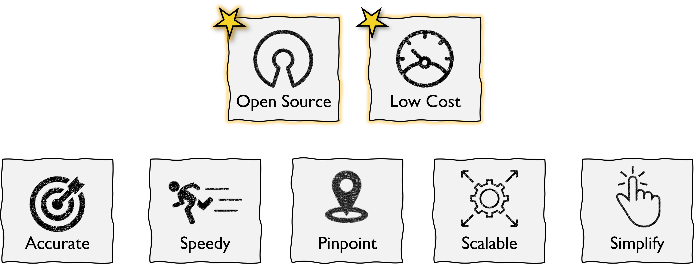

洞态简介
================
洞态专注于为企业提供 DevSecOps 解决方案，让企业运行的代码更安全.

**洞态 IAST** 是全球第一个完全开源的 IAST 项目。
它使用应用程序运行时数据流进行分析从而识别可被利用的安全漏洞（例如 SQL 注入或 XSS）。
此外，也为开发人员提供具有风险优先级的已验证漏洞列表，用于实时的代码修复。

**洞态 IAST 的优势**

 

- 完全开源的 IAST 项目

- 轻代理，重服务端的技术架构

- 实时检测、高检出率、低误报率、低漏报率

- 不产生脏数据，不对测试人员工作造成额外干扰

- 不需要重放数据包，可覆盖加密、防重放、验证码等真实业务场景

- 易于部署和安装

- 提供 CI/CD 集成解决方案

- 能够根据特定企业和行业的需求自定义漏洞规则