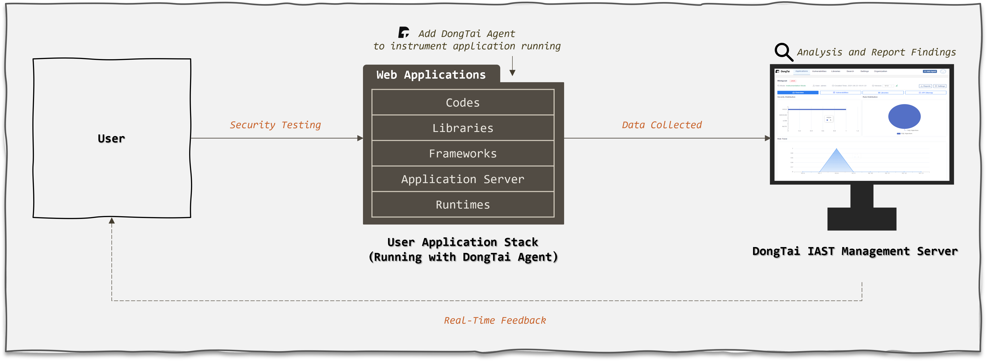

系统概览
==============

**洞态 IAST 由以下两个组件组成:**

- **洞态 IAST Agent:**

  用于监控 Web 应用服务器的数据流。 Agent 会通过代码插桩来监控请求并不断收集数据，然后将这些数据发送到洞态 IAST Server 端。
  
  如果在一台机器上部署了多个 Web 应用程序，需在每个 Web 应用程序服务器上安装一个洞态 IAST Agent。
  

- **洞态 IAST Server:** 

  洞态 IAST 架构的主要组成部分，提供了用户管理界面，使用洞态 IAST Agent 收集的数据去分析、识别漏洞并生成漏洞报告。同时，它也提供漏洞通知、Web-API、项目管理、自定义漏洞规则等功能。

**洞态 IAST 系统关系图:**

- 在常规的操作中，Web 应用程序会收到来自用户的 HTTP 请求。

- 插桩在 Web 应用程序的洞态 IAST Agent 将监控和收集流量中的数据，并将数据发送至洞态 IAST Server 端。

- 所有收集到的数据都会在洞态 IAST Server 端上进行分析, 当识别漏洞，服务器将通报用户, 用户可在管理服务器上查看完整的漏洞报告。
