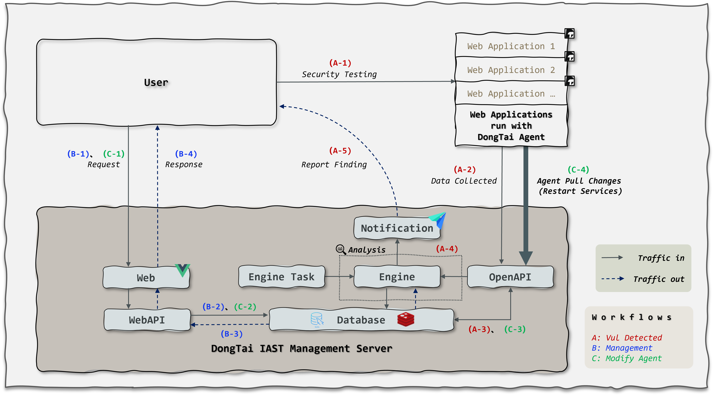

系统架构
============
高层体系结构（HLA）
-------------------------

我们将在下列描述各组件以及它们是如何运作的：

- **洞态 IAST 客户端组件:** 

  - ``Agent:`` 与 Web 应用程序一起部署，用于监控 Web 应用程序服务器的数据流。 它将收集数据并通过 OpenAPI 将数据发送到洞态 IAST Server 端。

- **洞态 IAST Server 端组件:** 

  - ``Web:`` 管理界面，供用户管理用户组、Web 应用检测项目、漏洞报告、 Agent 、自定义漏洞规则等。

  - ``WebAPI:`` 用于处理和响应来自用户的请求。

  - ``OpenAPI:`` 将 Agent 端收集到的数据存储至数据库中,同时也通过监视心跳等返回的数据来监控 Agent 的可用性。
 
  - ``Database:`` 存储数据。
 
  - ``Engine Task:`` 将分析任务分配给 Engine。
 
  - ``Engine:`` 通过漏洞规则分析收集到的数据以识别漏洞, 当检测到漏洞，会将漏洞详细信息存储在数据库中，并触发通知组件通报用户。
 
  - ``Notification:`` 通报用户的第三方 API。

业务流程
---------------------

- **漏洞检测流程:** 

  :red:`A-1 ~ A-5`

  - A-1: 在常规的操作中，Web 应用程序会收到来自用户的 HTTP 请求。

  - A-2: 插桩在 Web 应用程序的 ``Agent`` 将监控和收集来自流量的数据，然后通过 ``OpenAPI`` 将数据发送到洞态 IAST Server 端。
 
  - A-3: 当 ``OpenAPI`` 收到数据，它会将数据存入数据库并触发 ``Engine``。
 
  - A-4: ``Engine`` 开始分析和识别漏洞。
 
  - A-5: 当漏洞被识别用户将收到通报。

- **管理流程:** 

  :blue:`B-1 ~ B-4`
 
  - B-1, B-2: ``WebAPI`` 将处理来自 ``Web`` 的用户请求。
 
  - B-3, B-4: ``WebAPI`` 将响应结果通过 ``Web`` 回传给用户。

- **修改 Agent 设置流程:** 
 
  :green:`C-1 ~ C-4`
 
  - C-1, C-2: ``WebAPI`` 将处理来自 ``Web`` 的用户请求并将变化存储在数据库中。
 
  - C-4, C-3: 当客户端 Web 应用程序重新启动， ``Agent`` 将通过 ``OpenAPI`` 拉取并使用变化的设置。