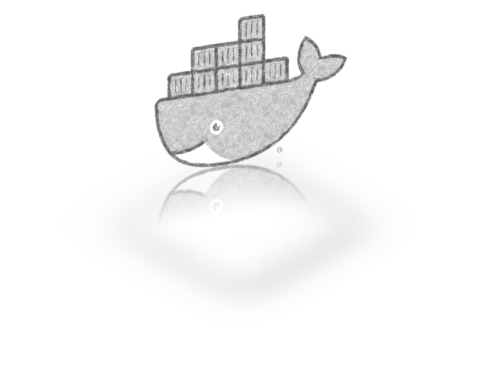
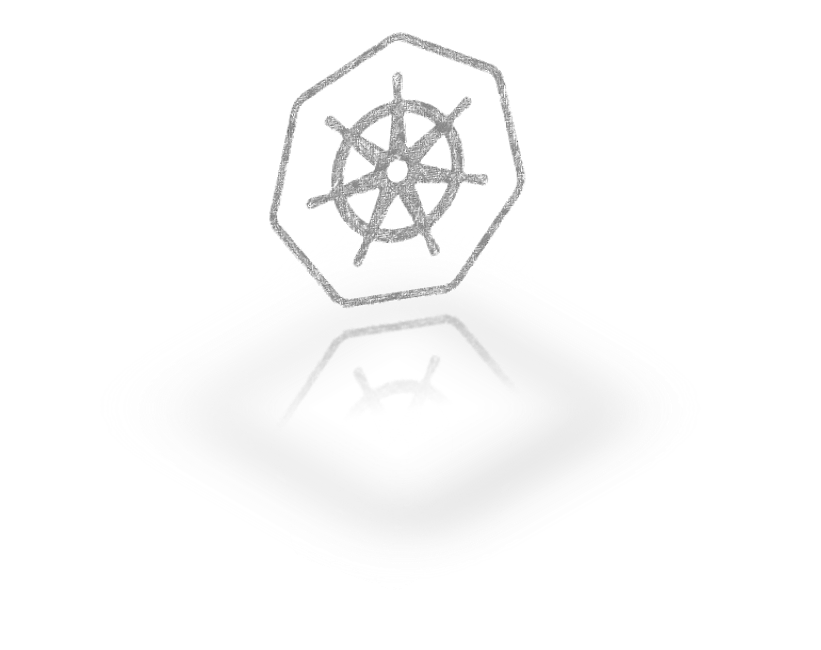

概述
========

Step 1: 部署洞态 IAST Server 端
------------------------------------------------

您可以使用 ``洞态 SaaS 版本`` 注册一个使用帐户或在本地部署您自己的管理服务器。

我们提供 ``Docker`` 和 ``Kubernetes`` 部署解决方案。

.. image:: ../_static/02_start/dongtai2.png
  :alt: dongtai_iast_saas
  :scale: 25%
  :target: ../04_ops/00_register.html

Step 2: 在 Web 应用程序上安装代理
----------------------------------------------------------
选择语言并开始安装

.. image:: ../_static/02_start/java.png
  :alt: java
  :scale: 25%
  :target: 03_agent.html#java-agent

.. image:: ../_static/02_start/python.png
  :alt: python
  :scale: 25%
  :target: 03_agent.html#python-agent

Step 3: 开始一个新的检测项目
----------------------------------------------------------
.. image:: ../_static/02_start/start.png
  :alt: start
  :scale: 25%
  :target: ../04_ops/01_startproject.html#step-0-add-agent-and-ensure-agent-is-running

.. tip:: 详情请点击图标.