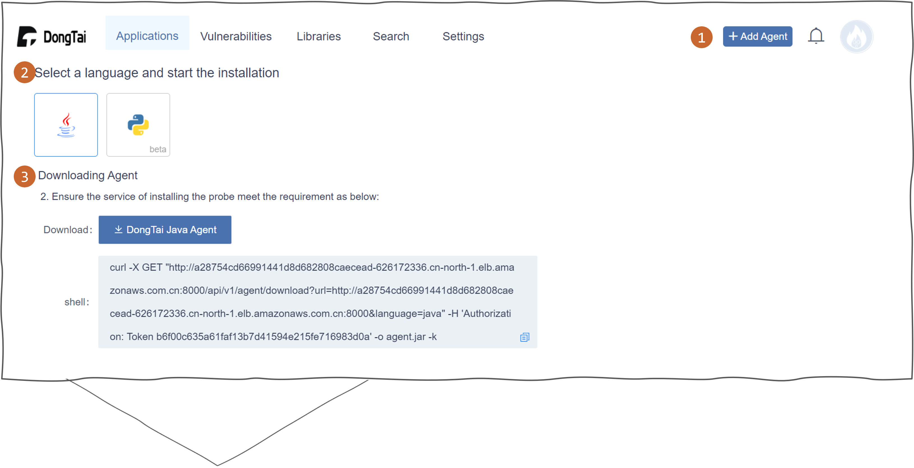

Agent 安装指南
===========================
下载 Agent 
----------------------
#. 登入洞态 IAST Server 端，并点选右上方的 :blue:`Add Agent`。

#. 选择语言后开始下载。

Java Agent
--------------
安装环境
++++++++++++++++
- 检查 Agent 所在应用程序系统与 ``DongTai OpenApi`` 之间的网络环境是可以互相连接。

- 确认 Agent 端所在环境在我们的支持列表中：

  - 作业系统: Windows/Linux/Unix

  - JDK 版本: 1.6+

  - Framework: Any

  - 中间件: Any

命令行执行安装
++++++++++++++++++++++++++++++++

.. code-block::

   java -jar agent.jar -m install -p <pid>

配置安装
+++++++++++++++++++++++++++++++++++++++++++

.. tabs::

   .. tab:: **SpringBoot**
       
       #. 将 ``agent.jar`` 放入具有写入权限的目录中, 如: :blue:`/tmp/`.
       
       #. Spring Boot 应用 
       
          a. 如果使用 WAR 包的方式部署，agent的安装方式为具体中间件的安装方式。
          
          b. 如果使用 JAR 包的方式部署，则直接在启动命令中增加启动参数即可： 
          
          .. code-block:: bash
              
              java -javaagent:/path/to/agent.jar -jar <app>.jar

   .. tab:: **Tomcat**
       
       进入 Tomcat 主目录中开启 :blue:`bin/catalina.sh` 文件并在文件首行增加以下配置：
       
       .. code-block:: bash
           
           CATALINA_OPTS="-javaagent:/path/to/server/agent.jar -Dproject.name=<application name>"

   .. tab:: **Jetty**
       
       直接在启动命令中增加启动参数即可:
       
       .. code-block:: bash
           
           java -javaagent:/path/to/agent.jar -Dproject.name=<project name> -jar <app>.jar
                 
   .. tab:: **JBoss**
       
       **JBoss AS 6**
       
       - 在 Jboss 容器中开启 :blue:`bin/run.sh` 文件并在 :blue:`# Setup JBoss specific properties` 中添加自定义配置：

       .. code-block:: bash

           JAVA_OPTS="$JAVA_OPTS "-javaagent:/path/to/agent.jar" "-Dproject.name=<application name>
           
       **JBoss AS 7、JBoss Wildfly**

       - 进入JBoss容器的主目录，根据当前服务器的启动类型： ``standalone``， ``domain`` 修改对应的配置文件。
       
         - Standalone Mode
         
           打开 :blue:`bin/standalone.sh` 并在 :blue:`# Display our environment` 中添加自定义配置：

         .. code-block:: bash
             
             JAVA_OPTS="$JAVA_OPTS "-javaagent:/path/to/agent.jar" "-Dproject.name=<application name>

         - Domain Mode
            - 设置 Server Group

            .. code-block:: bash
            
                <jvm-options>
                    <option value="-javaagent:<jboss_root>/path/to/agent.jar"/>
                    <option value="-Dproject.name=<project name>"/>
                </jvm-options>

            - 设置 Server

            .. code-block:: bash
                
                <jvm name="default">
                    <jvm-options>
                        <option value="-javaagent:<jboss_root>/rasp/rasp.jar"/>
                        <option value="-Dproject.name=<project name>"/>
                    </jvm-options>
                </jvm>
           
   .. tab:: **Resin**
        
        进入 Resin 的主目录打开 :blue:`bin/cluster-default.xml` 文件并在 :blue:`server-default` 中添加自定义配置：

        .. code-block:: bash
            
            <jvm-arg>-javaagent:/opt/agent/agent.jar</jvm-arg> <jvm-arg>-Dproject.name=<application name></jvm-arg>

   .. tab:: **WebLogic**
       
       **通过 WebLogic 管理平台修改配置**
       
       #. 至 :blue:`域结构 > 环境 > 服务器` 选择需要安装 Agent 的服务器。
       
       #. :blue:`服务器摘要 > 服务启动 > 参数` 中添加下列配置：
       
       .. code-block:: bash
           
            JAVA_OPTS="$JAVA_OPTS "-javaagent:/path/to/agent.jar" "-Dproject.name=<application name> 

       #. 重启服务器。

       **通过配置 WebLogic 中的 config.xml 文件**

       #. 至 :blue:`/u01/oracle/weblogic/user_projects/domains/base_domain/config` 打开 :blue:`config.xml` 文件。
       
       #. 在文件中的 :blue:`<server-start>` 标签里的 :blue:`<arguments>` 标签添加下列配置：

       .. code-block:: bash

            -javaagent:/path/to/agent.jar -Dproject.name=<application name>

   .. tab:: **WebSphere**

       #. 进入WebSphere WEB端的管理后台，在控制台左侧的导航栏里，选择 :blue:`Server > Server Types > WebSphere Application Server`。

       #. 选择需要安装 Agent 的应用程序服务器，点击进入管理页面。并在新页面下方找到 :blue:`Server Infrastructure > Process definition`。

       #. 点击 :blue:`Additional Properties > Java Virtual Machine` 进入JVM启动参数编辑界面。

       #. 找到 :blue:`Generic JVM arguments`, 添加以下配置并保存：

       .. code-block:: bash

            -javaagent:/path/to/agent.jar -Dproject.name=<application name>
.. tip:: 
    
    - ``-Dproject.create=true`` 为可选参数，将自动创建项目。

    - ``-Dproject.name=<project name>`` 为可选参数， ``<application name>`` 与创建的项目名称保持一致， Agent 将自动关联至项目；默认值为 ``Demo Project``。

    如果不配置上述参数，也可进入项目管理中进行手工绑定。

Python Agent
----------------
安装环境
++++++++++++++++
- 检查 Agent 所在应用程序系统与 ``DongTai OpenApi`` 之间的网络环境是可以互相连接。

- 确认 Agent 端所在环境在我们的支持列表中：

  - 作业系统: Windows/Linux/Unix

  - Python 版本：3.3+

  - 解释器：CPython

  - 中间件：uWSGI

  - Web 框架：Django

  - Web Service：Django REST Framework

  - Python 依赖包：psutil >= 5.8.0，requests >= 2.25.1，pip >= 19.2.3

安装 Agent 
+++++++++++++++++++++++++++++++++
- 找到第一步下载的压缩文件执行以下命令

.. code-block::

   pip3 install ./dongtai-agent-python.tar.gz

- 项目配置
+++++++++++++++++++++++++++++++++++++++++++

.. tabs::

   .. tab:: **Django**
       
       - 修改 Django 项目中的 :blue:`settings.py`, 在 ``MIDDLEWARE`` 中增加下列配置：

       .. code-block:: python

           MIDDLEWARE = [ 
               'dongtai_agent_python.middlewares.django_middleware.FireMiddleware',
               #...
            ]  

   .. tab:: **Flask**
         
       - 在 :blue:`<app.py>` 文件中新增下列配置:

       .. code-block:: python
           
           app = Flask(__name__)
           
           # Add agent
           from dongtai_agent_python.middlewares.flask_middleware import AgentMiddleware
           app.wsgi_app = AgentMiddleware(app.wsgi_app, app)
           

重启服务器
+++++++++++++++++++++++++++++++++++++++++++

使用命令 ``dongtai-cli run <启动参数>`` 启动项目, 启动参数为程序原有的启动命令

Example:

.. code-block:: bash
    
    # Django
    $ dongtai-cli run python manage.py runserver ...
    # or
    # Flask
    $ dongtai-cli run flask run ...
    # or
    $ dongtai-cli run uwsgi ... 
    

    - ``-Dproject.create=true`` 为可选参数，将自动创建项目。

    - ``-Dproject.name=<project name>`` 为可选参数， ``<application name>`` 与创建的项目名称保持一致， Agent 将自动关联至项目；默认值为 ``Demo Project``。    
    如果不配置上述参数，也可进入项目管理中进行手工绑定。

排错指南
-----------

.. tabs::

   .. tab:: **Java**
       
       - **重启您的应用服务器**

       Agent 安装后会显示在 DongTai IAST 管理服务中 :blue:`系统配置 > 引擎管理` 的引擎列表中。

       待 1 - 2 分钟刷新界面后，如果没有 Agent 没有显示在列表中，可按照如下步骤进行排查:
       
       **1. 检查 Agent 是否安装**

       .. code-block:: bash
           
           # 运行查看是否反馈 agent.jar 的使用帮助
           java -jar /temp/agent.jar
        
       .. tip::
           
           如果没有，说明 Agent 没有正确安装，请重新下载后再次安装。

       **2. 检查网络情况**
         
       在 Web 应用服务器中，检查是否可访问 https://openapi.iast.io
         
       如果不可访问，说明网络不通，请解决网络访问的问题。

       .. note::
           
           **如问题尚存在, 请前往** |GitHub| **给工程师提交 issue，我们会及时给您回复。**

   .. tab:: **Python**
       
       - **重启您的应用服务器**

       Agent 安装后会显示在 DongTai IAST 管理服务中 :blue:`系统配置 > 引擎管理` 的引擎列表中。

       待 1 - 2 分钟刷新界面后，如果没有 Agent 没有显示在列表中，可按照如下步骤进行排查:
       
       **1. 检查 Agent 是否安装**

       .. code-block:: bash
           
           # 运行查看是否反馈 dongtai-agent-python 的使用帮助
           pip3 show dongtai_agent_python
        
       .. tip::
           
           如果没有，说明 Agent 没有正确安装，请重新下载后再次安装。

       **2. 检测 Django/Flask 的中间件相关的修改是否已经增加**

       如没有请按上方说明进行修改。

       **3. 应用启动时有错误信息**

       查看是否与 Agent 相关，若与 Agent 有关，请将错误信息回报给我们。

       **4. 检查网络情况**
         
       在 Web 应用服务器中，检查是否可访问 https://openapi.iast.io
         
       如果不可访问，说明网络不通，请解决网络访问的问题。

       .. note::
           
           **如问题尚存在, 请前往** |GitHub| **给工程师提交 issue，我们会及时给您回复。**

.. |GitHub| raw:: html

   <a href="https://github.com/HXSecurity/DongTai/discussions" target="_blank">GitHub</a>

    
