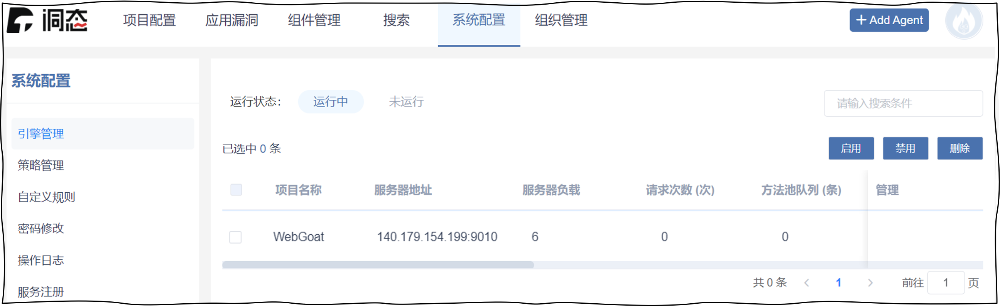
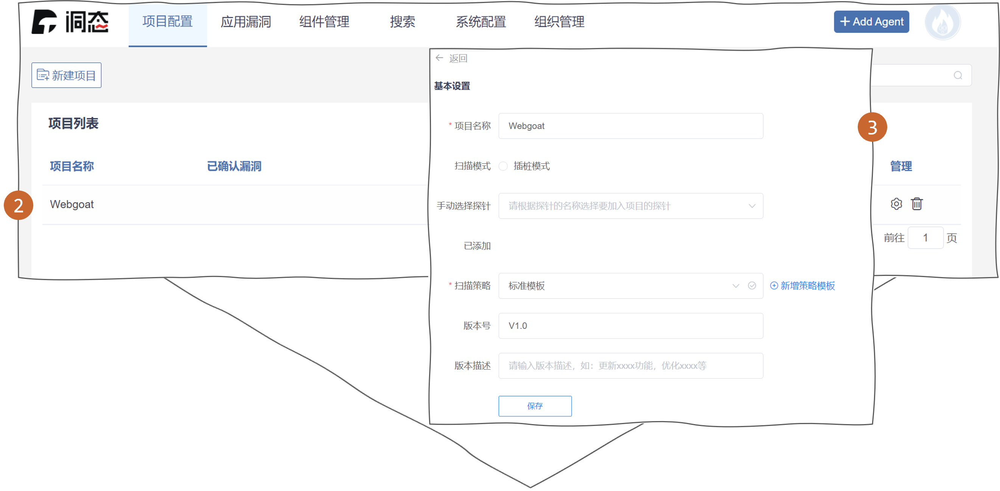
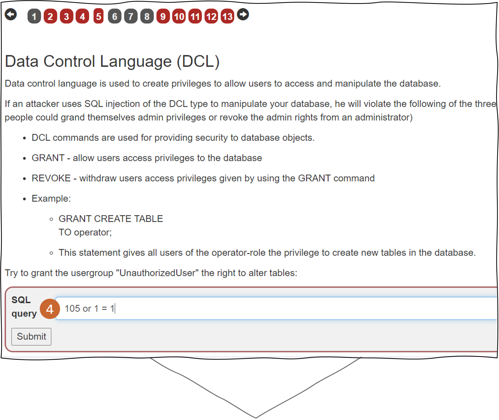
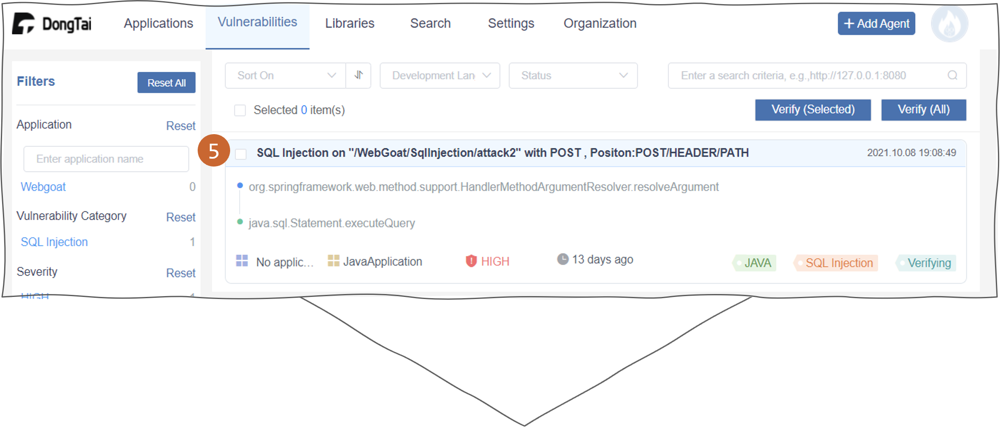
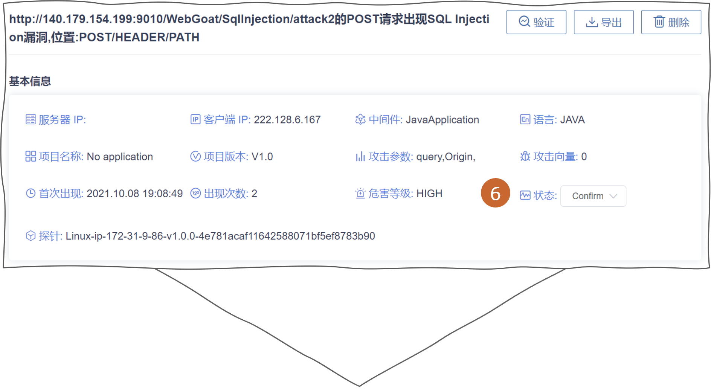
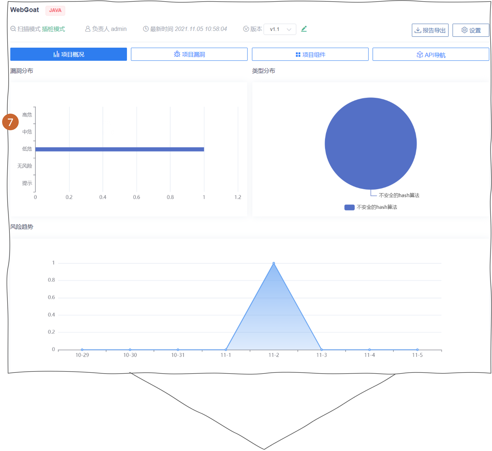

开启一个新的安全检测项目
===============================
步骤 0: 确认 Agent 已成功安装并运行
++++++++++++++++++++++++++++++++++++++++++++++
1. 可在 :blue:`系统配置 > 引擎管理` 中的引擎列表中查询 Agent 状态。

.. tip:: 
  
  :doc:`请参阅快速开始概述 <../02_start/01_overview>`

步骤 1: 开启安全检测项目
++++++++++++++++++++++++++++++++
2. 在 :blue:`项目配置 > 项目列表` 查看项目。

3. 您也能通过 :blue:`项目设置` 查询或修改项目信息。

步骤 2: 开启安全测试
++++++++++++++++++++++++++++++++++
4. 至 Web 应用程序中触发流量。

步骤 3: 查询漏洞信息
++++++++++++++++++++++++++++++++++++++++++
5. 所有被识别的漏洞将显示在洞态 IAST Server 端的漏洞列表中。

6. 您可以查看漏洞详情并对其进行标记。

7. 当漏洞被标记为 ``已确认``，它也会同步显示在项目概况中。

