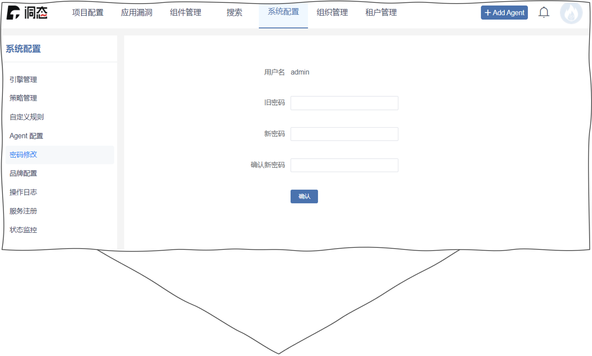
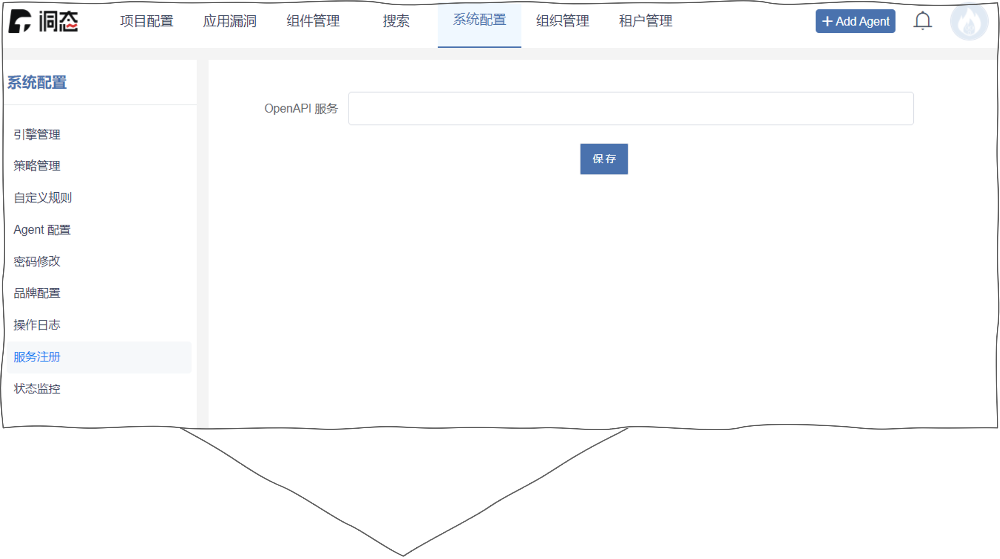
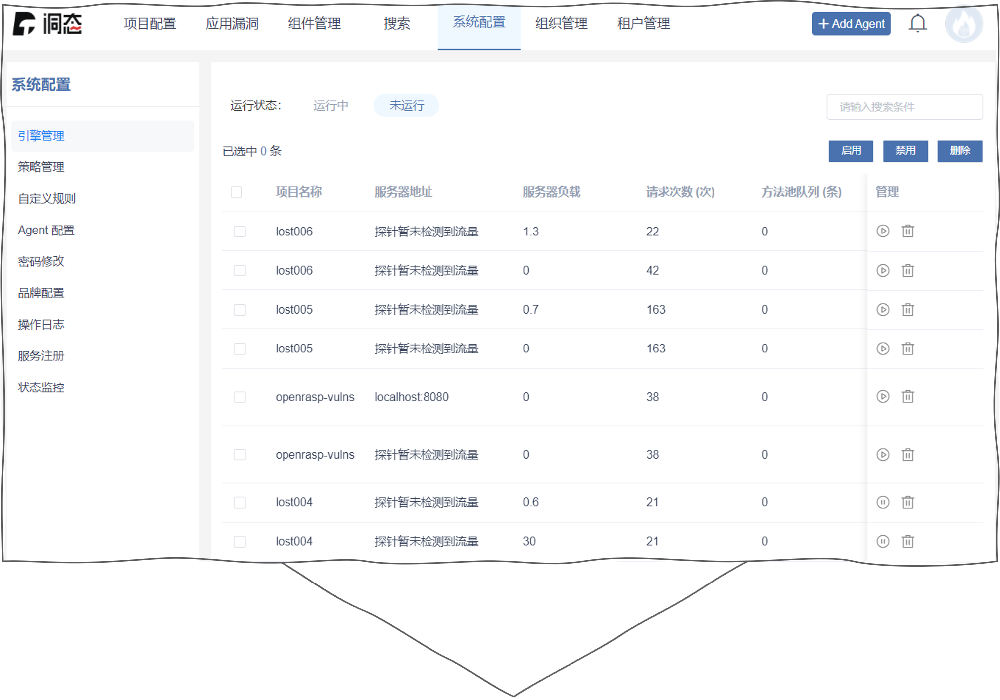
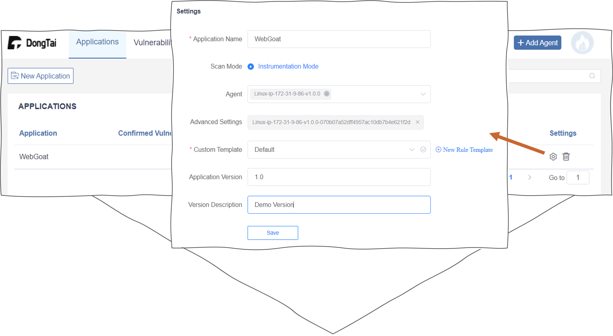

系统配置
=================
密码修改
----------------
:blue:`系统配置 > 密码修改` 修改密码。

服务注册
-----------------
:blue:`系统配置 > 服务设置` 设置 ``DongTai-OpenAPI`` URL。

引擎管理
--------------
:blue:`系统配置 > 引擎管理` 查询引擎状态 (``运行中``, ``未运行``) 和修改引擎状态 (``启用``, ``禁用``, ``删除``).

项目管理
-------------------
:blue:`项目配置 > 项目列表` 查询项目信息或修改项目设置.

