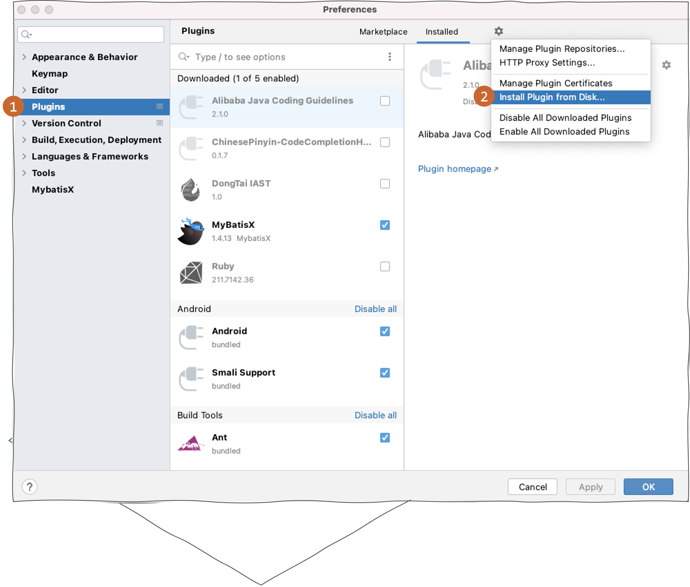
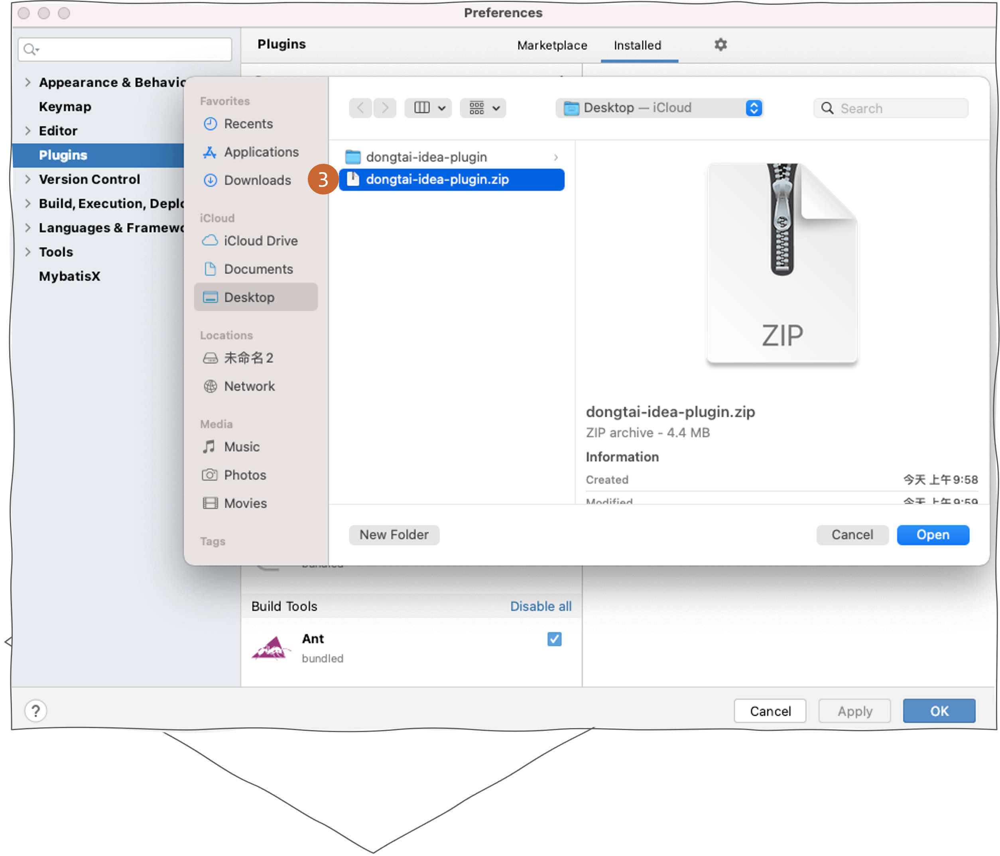
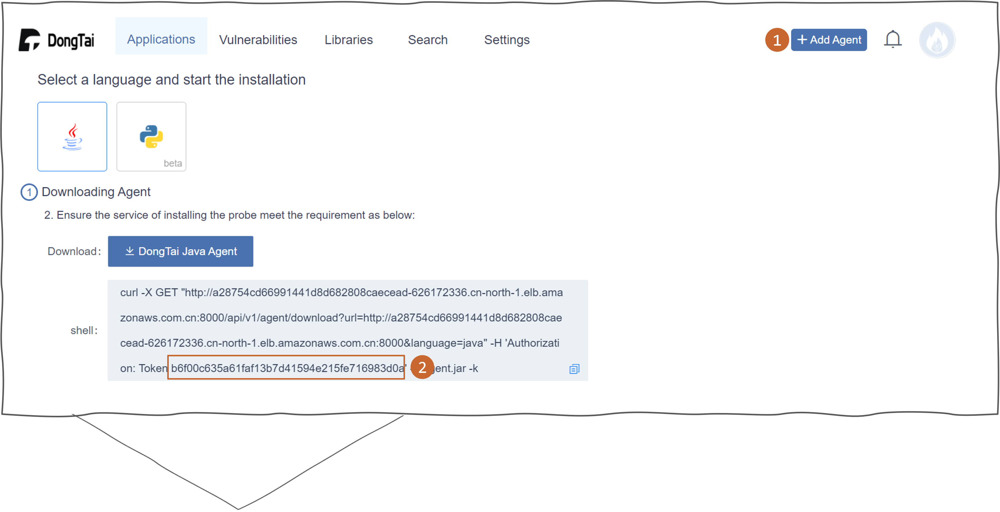
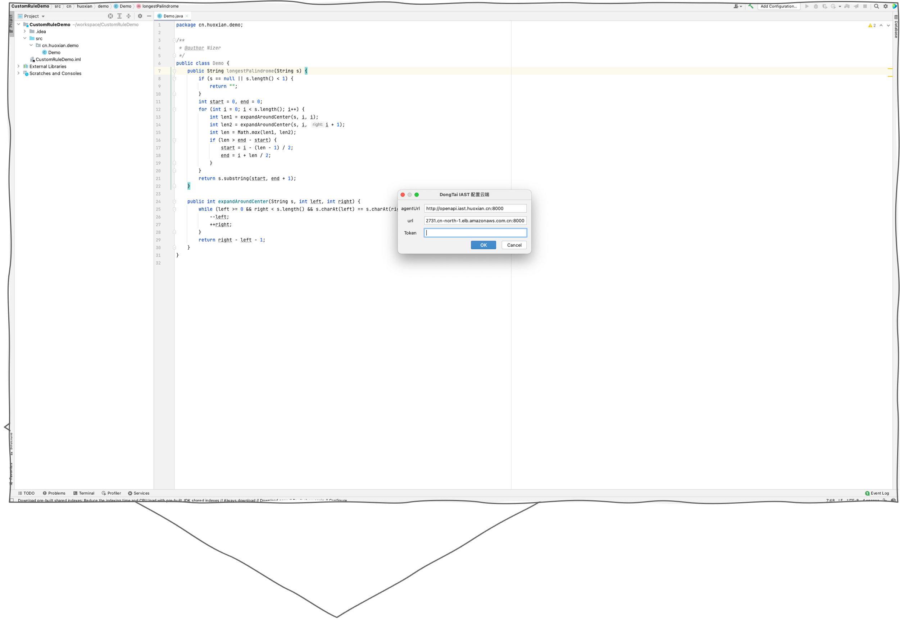

洞态 IAST 代理插件
===========================

Intellij IDEA 插件
---------------------------
简介
+++++++++++++
洞态 IAST IntelliJ IDEA 插件是面向开发人员的轻量级插件选项，提供了开发人员软件安全测试和修复的功能。

系统配置
+++++++++++++
IntelliJ IDEA 版本: 2020.3 以上

安装
+++++++++++++

从 IDEA 应用市场安装
^^^^^^^^^^^^^^^^^^^^^^^^^^

- 在 :blue:`Plugins > Marketplace` 搜寻 ``DongTai IAST`` 并安装。

.. image:: ../_static/05_ext/plugins_marketPlace.png
  :alt: plugins_marketPlace

离线安装
^^^^^^^^^^^^^^^^^^

- 下载 |DongTai IDEA plugin|.

.. |DongTai IDEA plugin| raw:: html

   <a href="https://github.com/HXSecurity/DongTai-Plugin-IDEA/releases/download/v1.0/DongTai-Plugin-IDEA.zip">洞态 IAST IDEA 插件安装包</a>

- 开启 IntelliJ IDEA 后点击 :blue:`Preferences > Plugin`。选择 :blue:`Install Plugin from Disk` 后开始安装插件。

.. image:: ../_static/05_ext/plugin_installs.png
  :alt: plugin_installs

配置插件
+++++++++++++++++++++

- 至 DongTai IAST Server 端右上方的 :blue:`Add Agent` 获取 ``Token``。

- 在 IntelliJ IDEA 界面上点击 :blue:`Tools > DongTai IAST Cloud Service Configuration` 并填入 ``Token``。

.. note::
  
  ``agentUrl, url``:  若使用洞态 IAST Server 端 SaaS 版，此栏位将预设自动输入。自动部署, :red:`需要` 自行填入。

Run/Debug 启动
++++++++++++++++++++++++++
- 下图展示两种使用洞态 IAST 插件启动安全测试项目的方式：

.. image:: ../_static/05_ext/plugin_run_debug_app.png
  :alt: plugin_run_debug_app

- 下方 ``控制台`` 会显示安全测试日志。 

.. image:: ../_static/05_ext/plugin_agent_add.png
  :alt: plugin_agent_add

- 可在插件中实时查看漏洞信息。

.. image:: ../_static/05_ext/plugin_taint_details.png
  :alt: plugin_taint_details

排错
++++++++++++++++++
- 若 ``Event Log`` 弹出错误提示。请检查 ``Token`` 是否输入正确。

.. image:: ../_static/05_ext/plugin_failure.png
  :alt: plugin_failure
